# CSS Grid

### Qué es CSS Grid

Es un sistema de maquetación en rejilla pensado para distribuir el contenido en filas y/o columnas. Esto nos permite trabajar sobre dos ejes, el horizontal (x) y el vertical (y).
También permite dividir una página o elemento en áreas o regiones.
El grid se define en la propiedad `display` con el valor `display: grid` o `display: inline-grid`. Una vez definido, todos los hijos directos se convertirán en elementos de la cuadrícula.

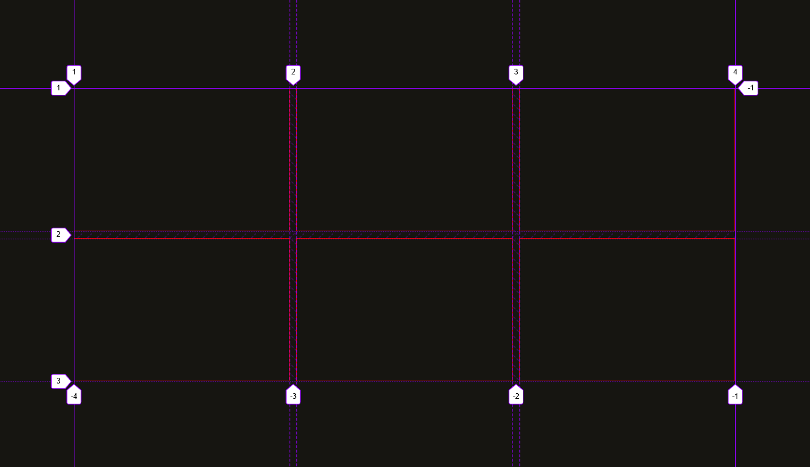

### Partes de un Grid

- **Grid Tracks o pistas** es el espacio entre dos líneas. Definen la fila (grid row) o la columna (grid column).

  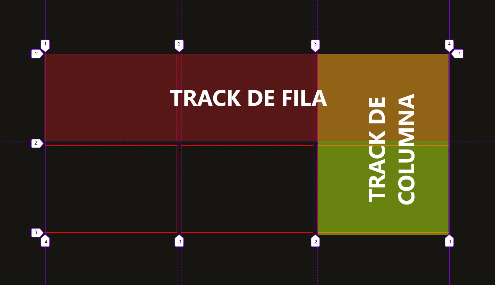

- **Líneas de cuadrícula** se crean al definir las pistas. La numeración de la siguiente imagen muestra el número de línea vertical y horizontal.

  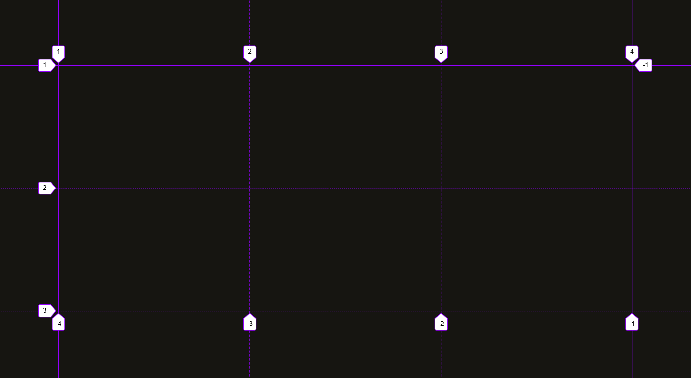

- **Grid Cell o celda** es la división más pequeña que puede tener un grid. Está delimitada por dos líneas verticales y dos horizontales. Si no tenemos definidas estas celdas de manera explícita Grid generará de manera automática una celda por cada elemento hijo que encuentre y este pasará a ocupar dicha celda.

  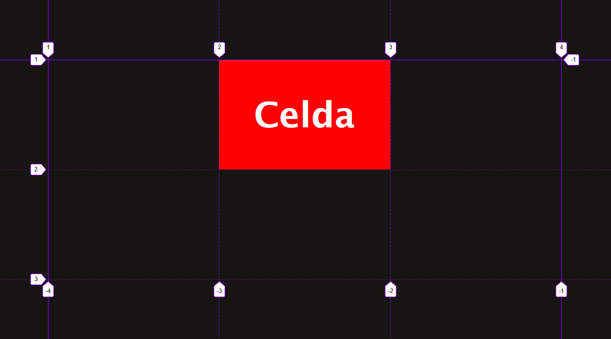

- **Grid Áreas** se crean a partir de una o más celdas y siempre deben ser de naturaleza rectangular, es decir no podemos crear un área en forma de "T" por ejemplo.

  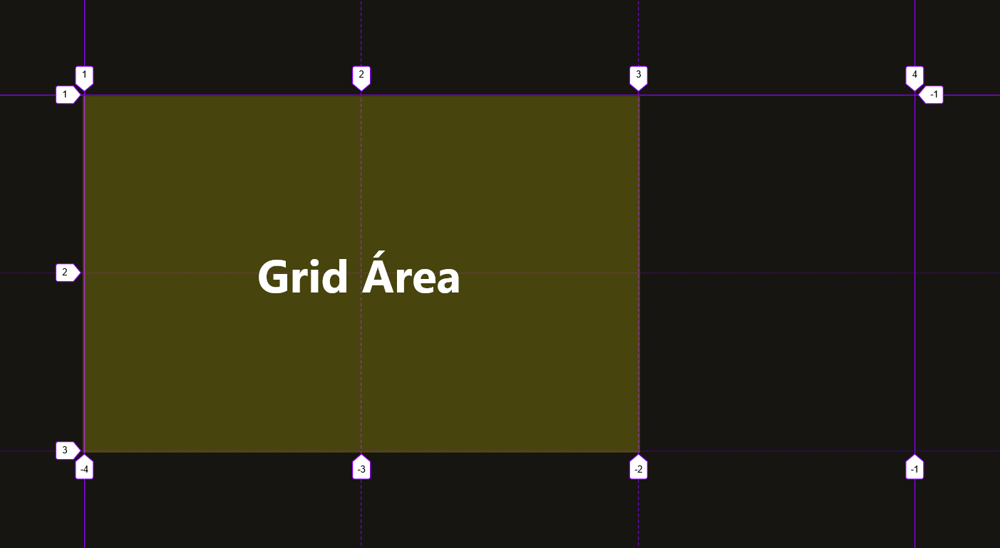

- **Grid Gutters o Gap** es un espacio que podemos controlar y que separa cada pista o track. Es la parte sombreada de la siguiente imagen.

  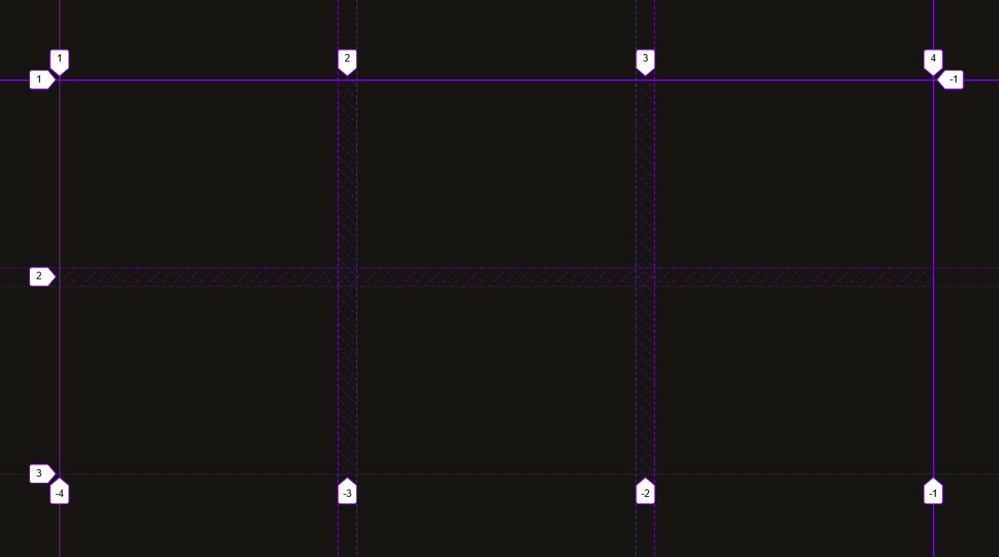

### Propiedades

#### Estructura del grid

> Antes de ver las siguientes propiedades tenemos que tener claros dos conceptos claves, la `cuadrícula implícita` y la `cuadrícula explícita`.
> Cuando hablamos de **cuadrícula explícita** nos referimos a las filas y columnas que definimos mediante alguna de las propiedades que veremos a continuación.
> La **cuadrícula implícita** hace referencia a las filas y columnas no definidas pero que grid puede crear si fuera necesario para el contenido. Este comportamiento también podremos controlarlo como veremos más adelante.

- **grid-template-columns** define el ancho de una o varias columnas de manera individual pudiendo asignar un nombre a cada una de las líneas (verticales) `grid-template-columns: [primera-linea] 50px [segunda-linea] 20% 1fr auto [ultima-linea];`
- **grid-template-rows** define el alto de una o varias filas de manera individual pudiendo asignar un nombre a cada una de las líneas (horizontales) `grid-template-rows: 100px 100px 200px;`
- **grid-template-areas** define y da nombre a cada uno de los **grid area**

  ```css
  grid-template-areas:
  	"a b c"
  	"a b c"
  	"a d e";
  ```

  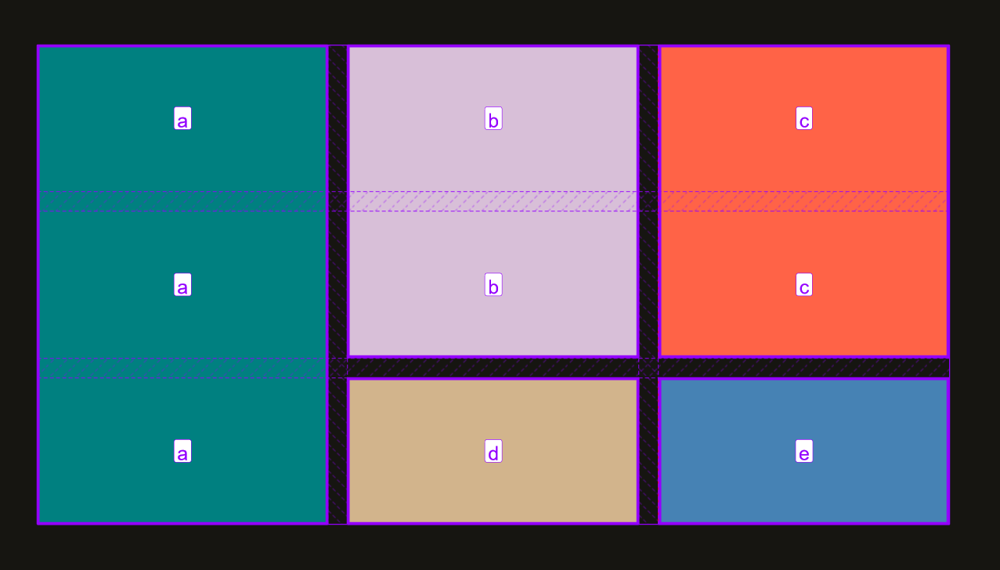

- **grid-template** propiedad que engloba las tres anteriores (shorthand para area, row y column).

  ```css
  grid-template:
  	[f1l1] "a a a" 40px [f1l2] /* primera fila */
  	"b c c" 40px /*segunda fila */
  	"b c c" 40px /* tercera fila */
  	/ 1fr 1fr 1fr; /* estructura de columna */
  ```

- **grid-auto-columns** define el ancho de todas las posibles columnas no definidas en el Grid Container `grid-auto-columns: 200px;` `grid-auto-columns: auto;`
- **grid-auto-rows** define el alto de todas las posibles filas no definidas en el Grid Container `grid-auto-rows: 200px;` `grid-auto-rows: auto;`
- **grid-auto-flow** Define la dirección en donde se ubicaran los elemento que no estén definidos como filas y columnas dentro del Grid Container.

  > Ejemplo: Tenemos definido un grid container de 3x3 ocupado con 5 elementos pero es posible que nuestra aplicación genere algún elemento más.
  > Con la propiedad **grid-auto-flow: column** y **grid-auto-columns: 100px** establecemos que todo elemento que venga de más se establezca en nuevas columnas con un ancho de 100px.

#### Posicionar elementos repecto a las líneas

- **grid-row-start || grid-row-end || grid-column-start || grid-column-end** se pueden usar de manera individual o conjunta para definir el inicio y fin del elemento en fila y columna.
  Si las columnas y filas se han definido nombradas (grid-template-columns) podemos utilizar el nombre en vez del número `grid-row-start: primera-linea;`
  Por ejemplo, si queremos que un elemento ocupe la fila 2 y las columnas 2 y 3 lo indicaríamos así:

  ```css
  .element {
  	grid-row-start: 2; /* define el inicio desde la línea de fila indicada */
  	grid-row-end: 3; /* define el fin en la línea de fila indicada */
  	grid-column-start: 2; /* define el inicio desde la línea de columna indica */
  	grid-column-end: 4; /* define el fin en la línea de columna indicada */
  }
  ```

  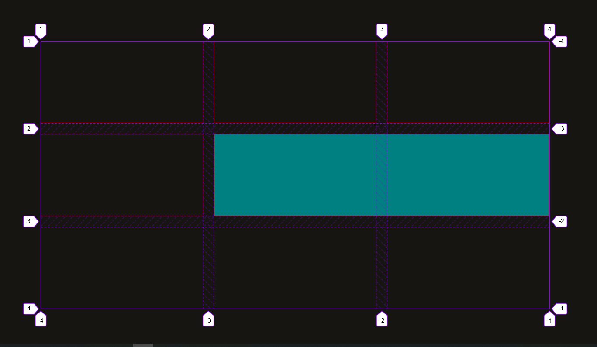

  **grid-row || grid-column** son los shorthand para poder definir principio y fin en una sola propiedad:

  ```css
  .element {
  	grid-row: 2 / 3; /* define el inicio y fin respecto a filas */
  	grid-column: 2 / 4; /* define el inicio y fin respecto a columnas */
  }
  ```

  **Otros valores** que podemos utilizar:

  - **-1** como valor de fin de fila o columna indica que ocupe todo el espacio de fila o columna.
  - **span** (se extiende) el elemento ocupará el número de filas o columnas indicado

    ```css
    grid-column: 1 / span 4; /* se extiende 4 líneas más después de la primera */
    ```

  - **auto** define el inicio o final de una fila o columna de manera automática

    ```css
    grid-row: 1 / auto;
    ```

#### Superposición de elementos

Los elementos de un grid pueden ocupar una misma celda superponiéndose entre ellos.

Podemos controlar este orden de superposición con la propiedad z-index en cada elemento

```css
.itemA  {
	grid-column: 1  /  3;
	grid-row: 1  /  2;
	z-index: -100;
}
.itemB  {
	grid-column: 2  /  3;
	grid-row: 1  /  3;
	opacity: 0.5;
}
```

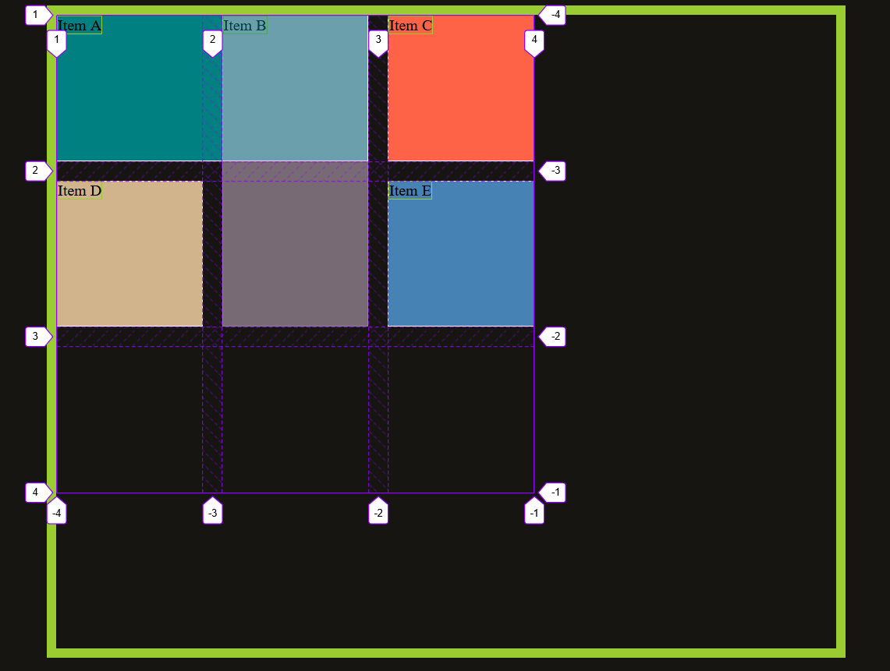

#### Espaciado entre elementos en el grid

- **row-gap** || **column-gap** || **gap** definen el gutter o espaciado entre columnas y filas.

- **row-gap** establece la separación entre filas `row-gap: 10px;`
- **column-gap** establece la separación entre columnas `column-gap: 10px;`
- **gap** es la propiedad abreviada o shorthand. Establece la separación entre filas y columnas, si sólo se proporciona un valor este se aplica para ambas `gap: 10px 20px;`

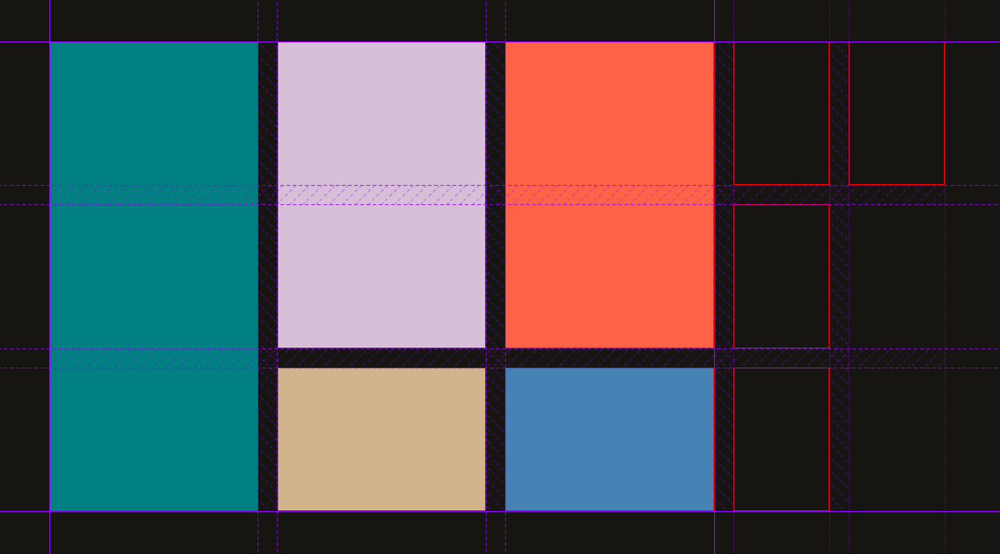

### Funciones

- **repeat()** Esta función puede ser usada en las propiedades `grid-template-columns` y `grid-template-rows`. Con ella podemos definir un número repetido de filas o columnas. La función admite dos parámetros, el primero es el número de repeticiones y el segundo el tamaño. Para crear cuatro columnas de 100px escribiríamos `grid-template-columns: repeat(4, 100px);`
- **minmax()** define un rango de tamaño mayor o igual que min y menor o igual que max. Puede ser usada dentro de: `grid-template-columns` `grid-template-rows` `grid-auto-columns` `grid-auto-rows`. Por ejemplo `grid-template-columns: minmax(50px, 100px) 1fr 1fr;`

### Valores

- **min-content** define el tamaño más pequeño de una caja sin que el contenido llegue a desbordar.
- **max-content** define el tamaño máximo de una caja en función de su contenido, es decir minimiza el espacio vacío y evita el desbordamiento. Si tenemos un contenedor padre con un ancho infinito y establecemos este valor a un elemento hijo cuyo contenido es un texto, el ancho máximo que ocupará será el que ocupe dicho texto.
- **fr** Grid introduce esta nueva unidad de medida. Lo que representa es una fracción del espacio disponible en el grid container. Al utilizarla podemos crear elementos que se expanden y encogen de acuerdo al espacio disponible.

> Podemos utilizar estos valores en las funciones anteriores para definir tamaños en filas y columnas.

### Alineación de elementos en un grid

#### justify-content || align-content

Permiten alinear los elementos de manera horizontal (justify-content) y vertical (align-content) dentro del grid container.

- **flex-start** posiciona la cuadrícula al inicio de su espacio vertical y/o horizontal (valor por defecto).

```css
justify-content: flex-start;
align-content: flex-start;
```

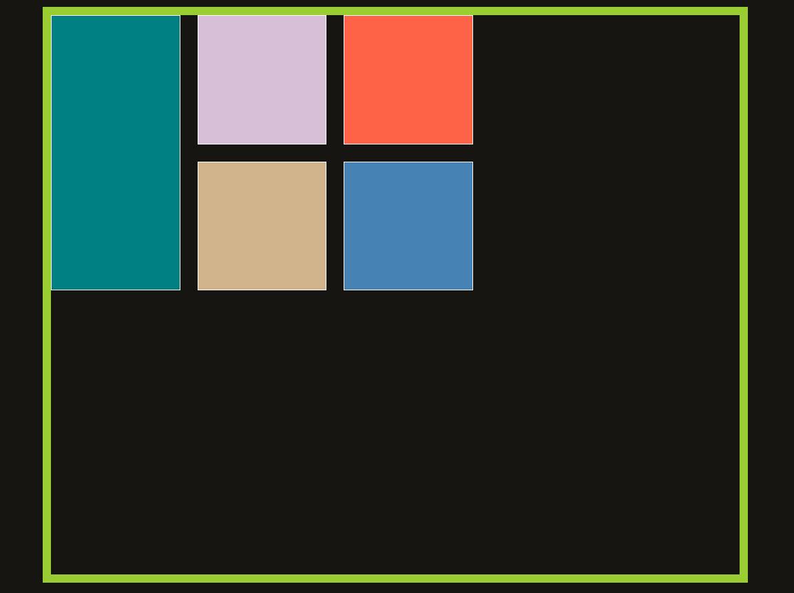

---

- **flex-end** posiciona la cuadrícula al final de su espacio vertical y/o horizontal.
  ```css
  justify-content: flex-end;
  align-content: flex-end;
  ```
  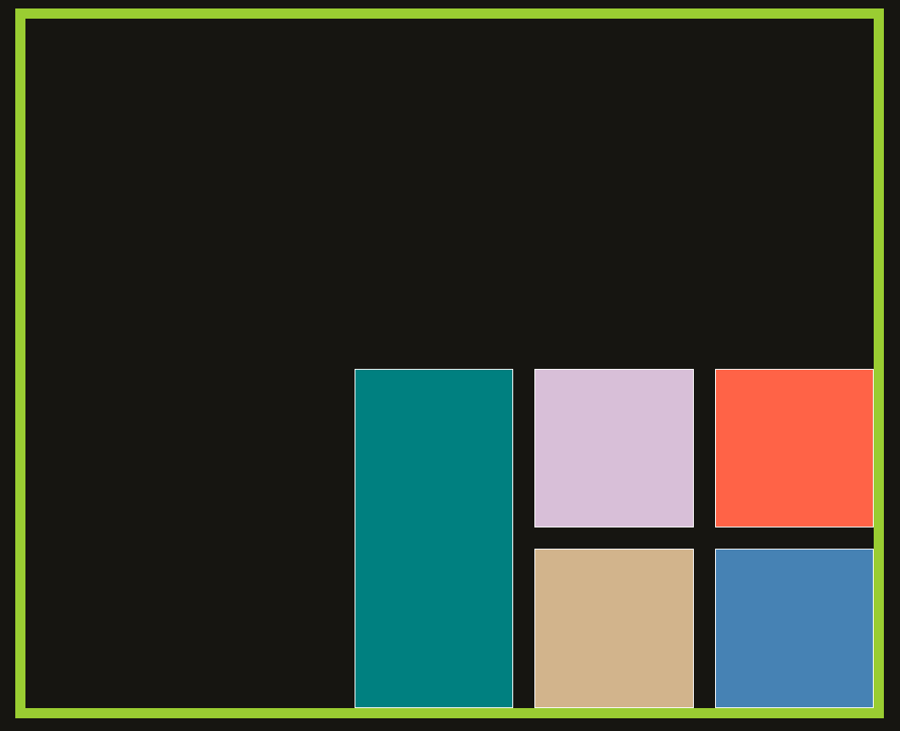

---

- **center** posiciona la cuadrícula en el centro de su espacio vertical y/o horizontal.
  ```css
  justify-content: center;
  align-content: center;
  ```
  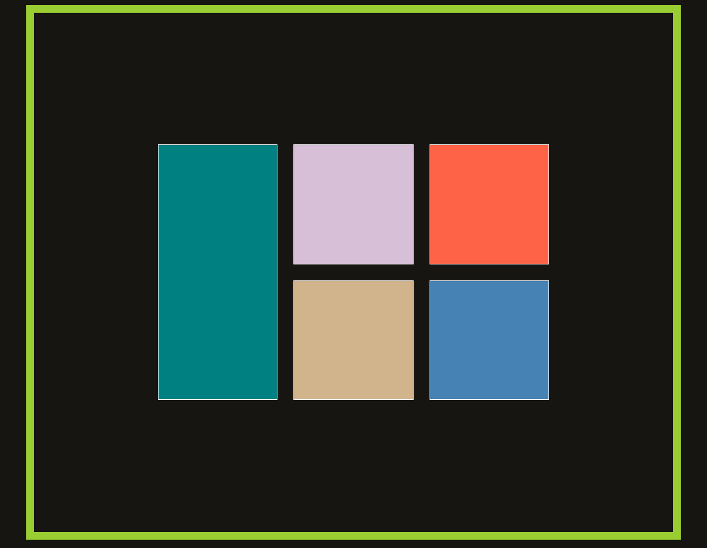

---

- **space-around** distribuye los grid items en el espacio disponible vertical y/o horizontal dejando el mismo espaciado entre ellos y otro variable alrededor.
  ```css
  justify-content: space-around;
  align-content: space-around;
  ```
  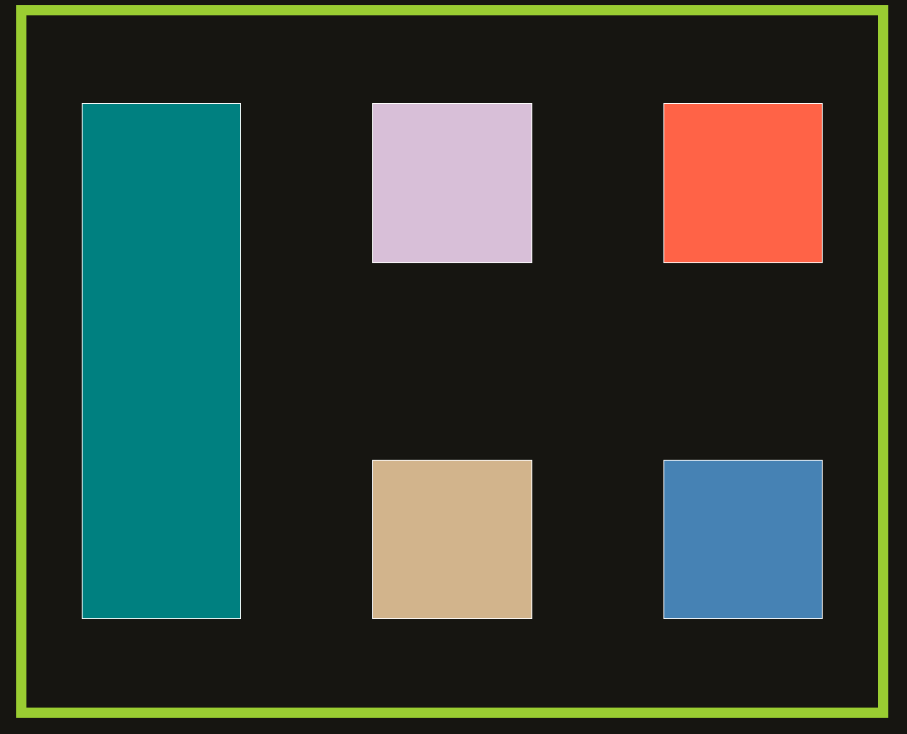

---

- **space-evenly** distribuye los grid items en el espacio disponible vertical y/o horizontal dejando el mismo espaciado entre y alrededor de ellos.
  ```css
  justify-content: space-evenly;
  align-content: space-evenly;
  ```
  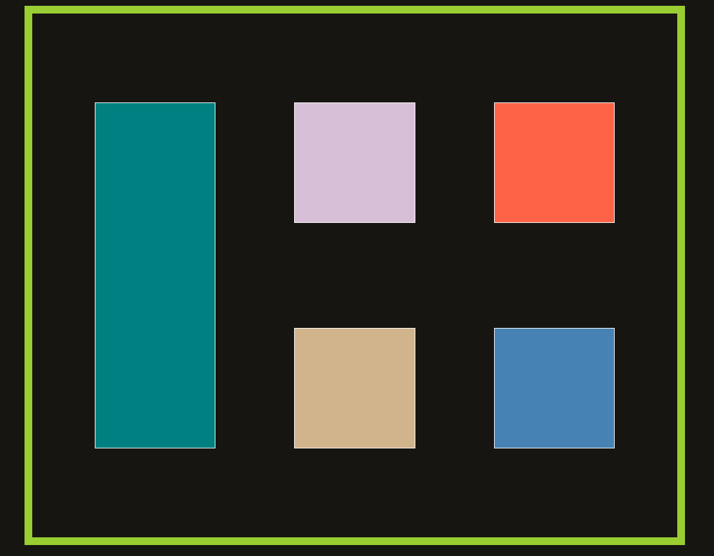

---

- **space-between** distribuye los grid items en el espacio disponible vertical y/o horizontal dejando el mismo espaciado entre ellos pero sin espaciado alrededor.
  ```css
  justify-content: space-between;
  align-content: space-between;
  ```
  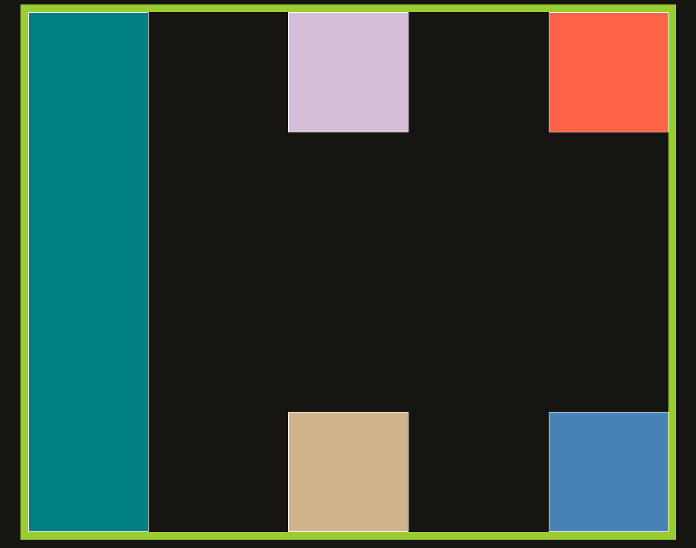

#### justify-items || align-items

Permiten alinear los elementos contenidos en los **grid items** (celdas o áreas) de manera simétrica en su espacio horizontal (justify-items) y en el vertical (align-items).

- **flex-start** posiciona los elementos al inicio de su espacio vertical y/o horizontal.
  ```css
  justify-items: flex-start;
  ```
  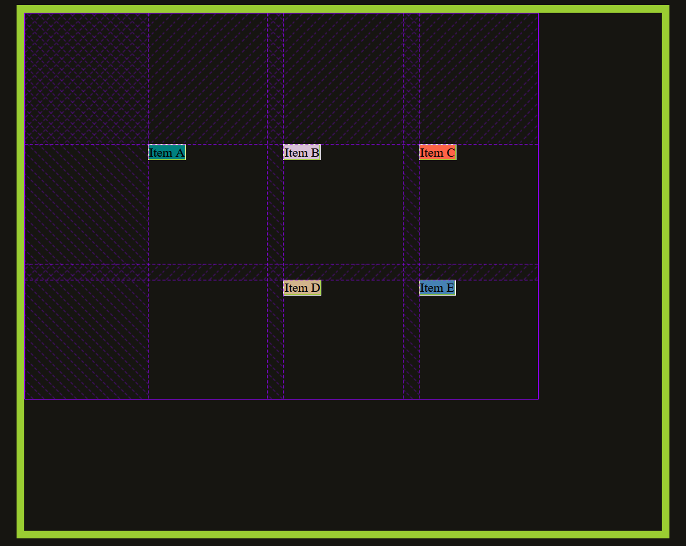

---

- **flex-end** posiciona los elementos al final de su espacio vertical y/o horizontal.
  ```css
  justify-items: flex-end;
  align-items: flex-end;
  ```
  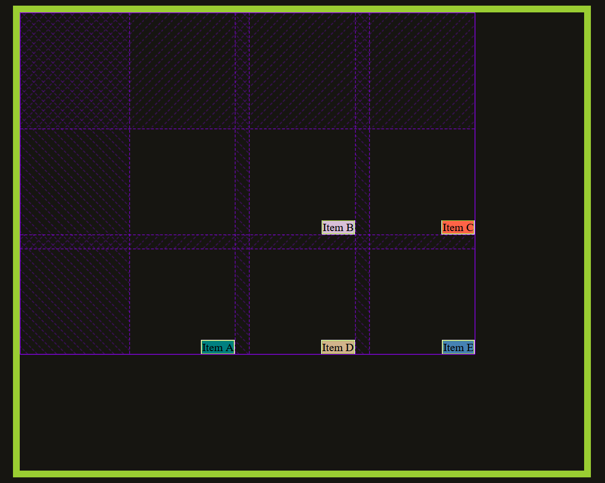

---

- **center** posiciona los elementos en el centro de su espacio vertical y/o horizontal.
  ```css
  justify-items: center;
  align-items: center;
  ```
  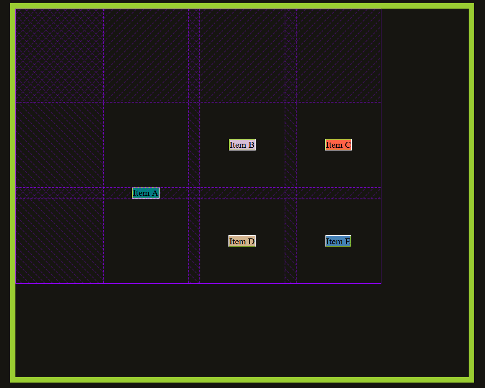

---

- **stretch** los elementos cubren todo el espacio que tienen disponible verticalmente si la propiedad es align-items o horizontalmente si la propiedad es justify-items.
  ```css
  justify-items: stretch;
  align-items: flex-end;
  ```
  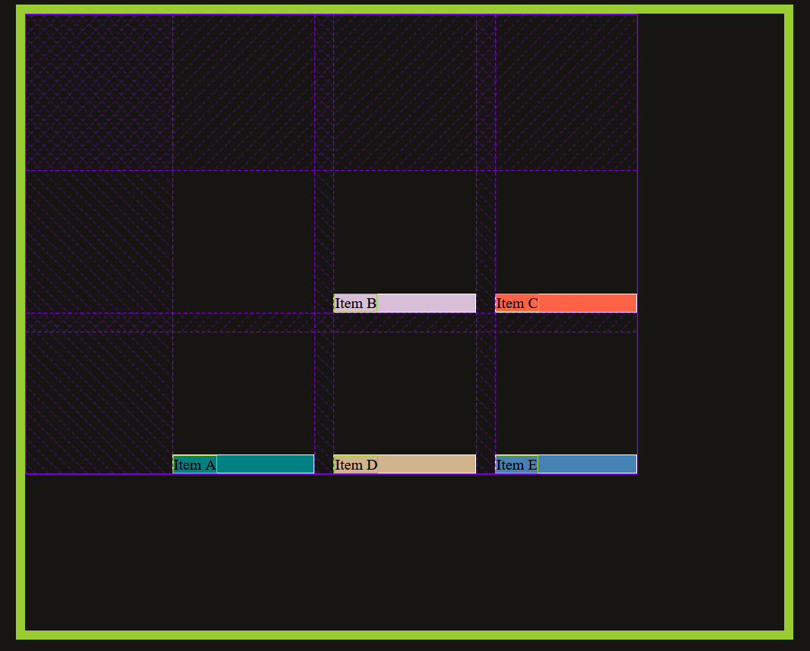

---

#### justify-selft || align-selft

Admiten los mismos valores que **justify-items** y **align-items**. La diferencia es que esta propiedad se utiliza de manera individual en los estilos de cada elemento y no desde el contenedor como en las anteriores (justify-self para horizontal y align-self para vertical).

```css
justify-items: stretch;
align-items: flex-end;
.grid-itemD {
	align-self: center;
}
```

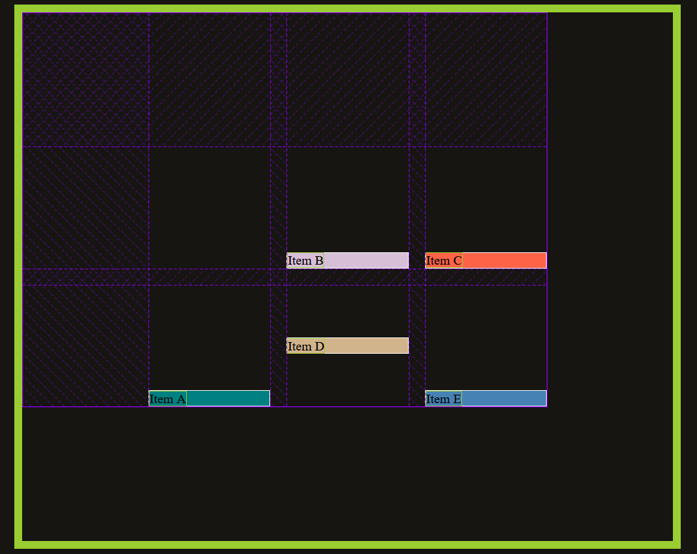

---

> https://developer.mozilla.org/es/docs/Web/CSS/CSS_Grid_Layout/Basic_Concepts_of_Grid_Layout
