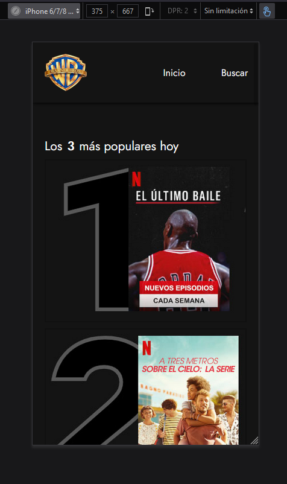
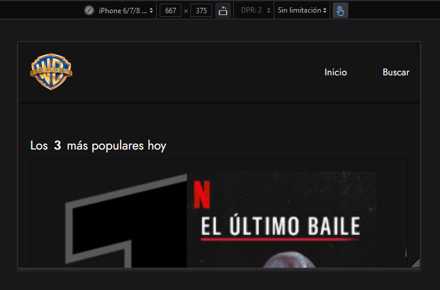
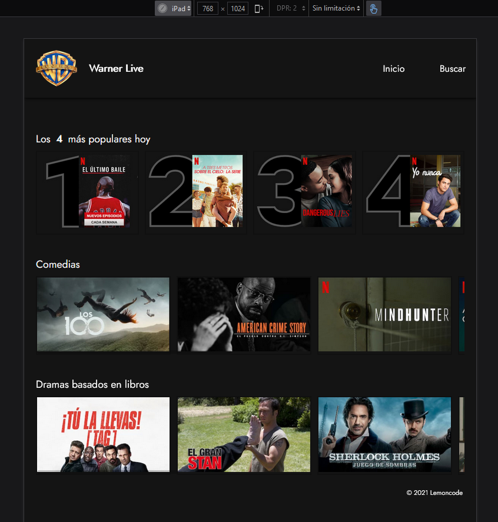
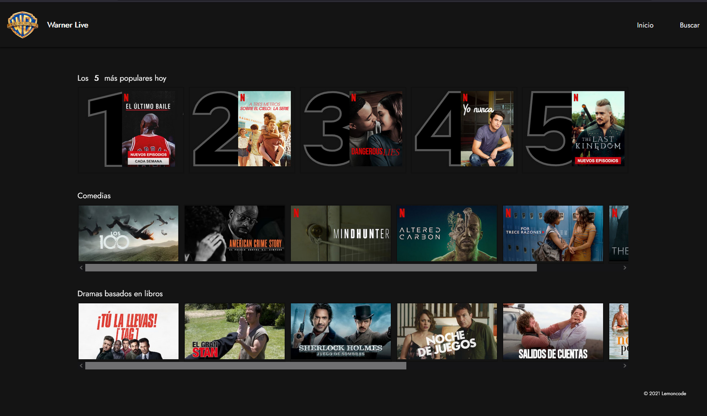

# 1 Laboratorio layout

## Práctica del módulo de layout.

Una conocida casa cinematográfica quiere crear su propia plataforma online para servir sus producciones, a la que van a llamar WARNER LIVE .
Nos han solicitado una prueba de maquetación de un primer diseño, del resultado de la prueba dependerá pasar a la siguiente fase de selección.

### Versión móvil

- El nombre del logo no se muestra.
- Solo se muestran los **3 más polulares**
- Todos los items aparecen en una sola columna.
- Tamaño mínimo de las imágenes 225px.

### Versión tablet

- Aparece el nombre al lado del logo
- Se muestran **los 4 más populares** (el se cambia desde css).
- Los items de película aparecen en fila y lleva scroll horizontal

## Versión escritorio

- Aparecen **los 5 más populares**
- Todo lo demás es igual a la versión tablet.
- El ancho máximo para el contenido es de 1228px.

