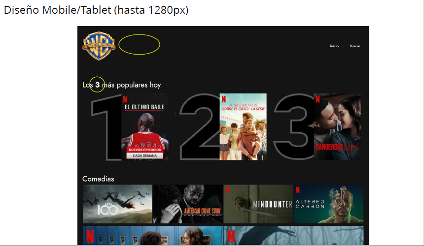
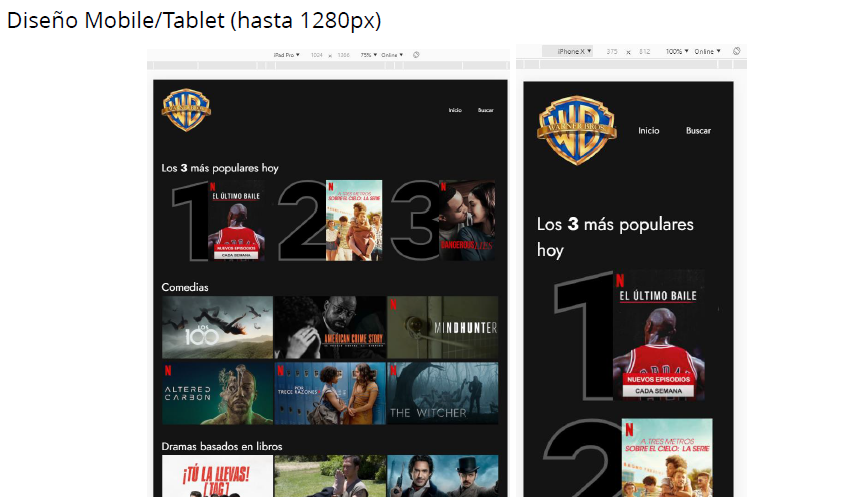

# 1_LAYOUT_ADVANCED

## Práctica del módulo de layout.

Una conocida casa cinematográfica quiere crear su propia plataforma online para servir sus producciones, a la que van a llamar WARNER LIVE .
Nos han solicitado una prueba de maquetación de un primer diseño, del resultado de la prueba dependerá pasar a la siguiente fase de selección.

**- **Detalle puntero sobre película\*\*

**Detalle puntero en menú y número en negrita en el título de "Los más vistos"**

**Ancho mínimo de la imagen**

**El nombre se oculta en resoluciones por debajo de 1280px**

**Diseño para tablet y mobile**

